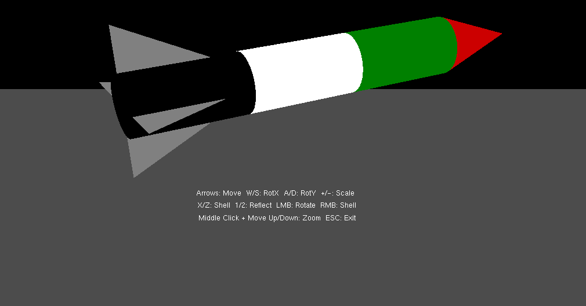

# 🚀 OpenGL Rocket with Shelling Effect


> A 3D rocket demonstration using OpenGL with a custom shelling effect and real-time transformations.

## 📋 Table of Contents
- [Features](#-features)
- [Technologies Used](#️-technologies-used)
- [Project Structure](#-project-structure)
- [How to Run](#️-how-to-run)
- [Controls](#-controls)
- [Implementation Details](#-implementation-details)
- [Preview](#-preview)
- [Notes](#-notes)
- [Author](#-author)

## 🧠 Features
- 3D rocket rendered with OpenGL
- **Shelling effect**: custom scaling along Z-axis
- Real-time transformations:
  - Translation
  - Rotation (X and Y axis)
  - Scaling
  - Reflection (X and Y axes)
- Depth testing for proper 3D rendering
- Smooth shading for better visuals

## 🛠️ Technologies Used
- **C++**
- **OpenGL**
- **GLUT / GLFW**
- **Visual Studio**

## 📁 Project Structure

```
OpenGL-Rocket/
│
├── .vs/Project1/                # Visual Studio configuration files
│
├── Dependencies/                # External libraries
│   └── GLFW/                    # GLFW library files
│
├── Project1/                    # Source code directory
│   ├── src/                     # Main source files
│   │   ├── main.cpp             # Entry point
│   │   ├── rocket.cpp           # Rocket model implementation
│   │   ├── shader.cpp           # Shader handling
│   │   └── transformations.cpp  # Transformation logic
│   │
│   ├── include/                 # Header files
│   │   ├── rocket.h             # Rocket model definition
│   │   ├── shader.h             # Shader class definition
│   │   └── transformations.h    # Transformation functions
│   │
│   └── resources/               # Resources (shaders, textures)
│       ├── shaders/             # GLSL shader files
│       └── textures/            # Texture images
│
├── x64/Debug/                   # Debug build files
│
└── Project1.sln                 # Visual Studio solution file
```

## ▶️ How to Run
1. Clone the repository or download the ZIP.
2. Open `Project1.sln` in Visual Studio.
3. Build and run the project.

> 🔁 Make sure you have **GLUT or GLFW** installed and properly linked.

### 🔧 Prerequisites
- Visual Studio 2019 or newer
- OpenGL compatible graphics card
- GLFW or GLUT libraries

### 📦 Setup Dependencies
The project includes GLFW dependencies, but if you need to set up manually:

1. Download GLFW from [official website](https://www.glfw.org/download.html)
2. Copy include files to `Dependencies/GLFW/include`
3. Copy library files to `Dependencies/GLFW/lib-vc2019`
4. In Visual Studio, ensure:
   - Include directories contain `Dependencies/GLFW/include`
   - Library directories contain `Dependencies/GLFW/lib-vc2019`
   - Linked libraries include `glfw3.lib` and `opengl32.lib`

## 🎮 Controls
| Key        | Action                 |
|------------|------------------------|
| Arrow Keys | Move rocket            |
| R          | Rotate rocket          |
| S          | Apply shelling effect  |
| X / Y      | Reflect across axis    |
| + / -      | Scale rocket up/down   |
| ESC        | Exit application       |

## 🔍 Implementation Details

### Shelling Effect
The shelling effect is implemented by scaling the rocket along the Z-axis. This creates a visually interesting effect similar to the mathematical concept of "shelling" where a 2D shape is extended into 3D space.

```cpp
// Example of shelling effect implementation
void applyShelling(float shellFactor) {
    // Scale along Z-axis only
    glScalef(1.0f, 1.0f, shellFactor);
}
```

### Transformations
All transformations are handled in the `applyTransformations()` function, which combines matrices for translation, rotation, scaling, and reflection. The transformation matrix is then passed to the shader program for rendering.

```cpp
// Example transformation matrix calculation
glm::mat4 transformMatrix = glm::mat4(1.0f);
transformMatrix = glm::translate(transformMatrix, position);
transformMatrix = glm::rotate(transformMatrix, rotationX, glm::vec3(1.0f, 0.0f, 0.0f));https://github.com/ELZAYDA/Palestine-Rocket/blob/main/README.md
transformMatrix = glm::rotate(transformMatrix, rotationY, glm::vec3(0.0f, 1.0f, 0.0f));
transformMatrix = glm::scale(transformMatrix, scale);
```

### Rendering Pipeline
1. The rocket model is defined using vertex and index buffers
2. Shader programs handle lighting and transformations
3. The render loop continuously updates the view and applies transformations
4. User input is captured to control the rocket's movement and appearance

## 📷 Preview



*Screenshot of the 3D rocket with shelling effect applied*

## 📌 Notes
- You can customize transformation values in `applyTransformations()` function.
- Shelling effect is controlled by scaling on the Z-axis only.
- The project demonstrates fundamental OpenGL concepts including vertex buffers, shader programs, and transformation matrices.
- The implementation focuses on educational purposes, showing how 3D transformations work in practice.

## 👨‍💻 Author

Ahmed Nabil - Engineer & Project Maintainer


📧 Email: ahmedelzayda19@gmail.com
🔗 Project: https://github.com/ELZAYDA/Palestine-Rocket/edit/


<p align="center">
  Made with ❤️ by Ahmed Nabil
</p>
